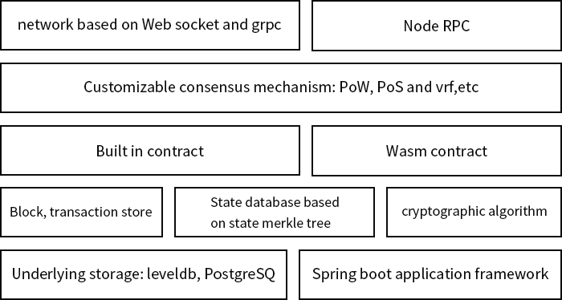

# 二、产品架构

&#160;&#160;&#160;&#160;&#160;&#160;如图所示，产品为 5 层，由下至上依次是存储层、数据层、协议层、共识层、合约层和网络层。

&#160;&#160;&#160;&#160;&#160;&#160;其中存储层主要用于存储账户数据及区块链元数据，存储技术主要使用文件系统、LevelDB和关系型数据库。

&#160;&#160;&#160;&#160;&#160;&#160;数据层主要用于处理交易中的各类数据，如将数据打包成区块，将区块维护成链式结构，区块中内容的加密与哈希计算，区块内容的数字签名及增加时间戳印记，将交易数据构建成 Merkle 树，并计算 Merkle 树根节点的 hash 值等。

&#160;&#160;&#160;&#160;&#160;&#160;区块链网络也是基于 P2P 网络的，在网络中每个节点既有客户端角色，又有服务端角色。

&#160;&#160;&#160;&#160;&#160;&#160;合约层分为两部分，一部分是 LotusVM(即虚拟机)，用户部署的智能合约代码运行在 LotusVM 中。智能合约是运行在以太坊上的代码的统称，一个智能合约往往包含数据和代码两部分。智能合约系统将约定或合同代码化，由特定事件驱动触发执行。因此，在原理上适用于对安全性、信任性、长期性的约定或合同场景。在TDS系统中，智能合约的默认编程语言是 TypeScript，一般学过 JavaScript 语言的读者很容易上手TypeScript。另一部分是系统内置合约，用户可以通过引入自定的jar包覆盖系统内置合约，无需部署编译即可加载，甚至可以通过改写系统内置合约实现自定义的共识机制。