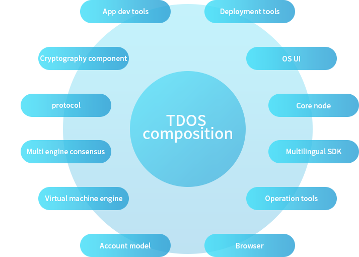

# 一、介绍
- ## 什么是Trusted Data Suite？
&#160;&#160;&#160;&#160;&#160;&#160;可信数据套件(TDS)的定位是:提供商业级的区块链基础设施服务，同时在 基础底层系统上，构建具有高可扩展的应用业务，为各行各业提供最专业的区块链底层系统技术。 
    
&#160;&#160;&#160;&#160;&#160;&#160;TDS是一套框架式的基础服务产品，包含多种服务组件，共同组成了完整的产 品矩阵 
- ## 如何使用本文档？
&#160;&#160;&#160;&#160;&#160;&#160;本文档包含了TDS的产品组成说明，以及底层的技术设计原理，在虚拟机章节说明了基于TDS的智能合约开发方法。通过本文档，可以完整的了解TDS的使用方法。
- ## TDS产品矩阵介绍
